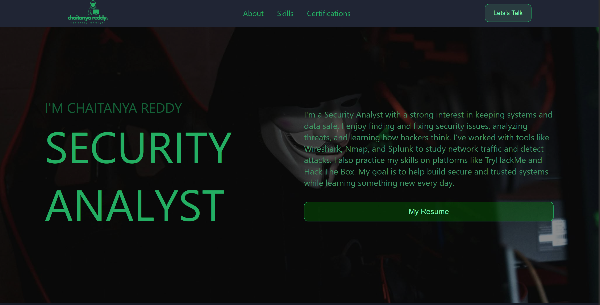

# Client Portfolio Website

A portfolio website designed and developed for a client to showcase their skills, certifications, and contact information with smooth animations.

## 🚀 Tech Stack
- **HTML5**
- **CSS3**
- **JavaScript (Vanilla JS)**
- **GSAP (GreenSock Animation Platform)**

## 🎯 Features
- Static layout (not fully responsive)
- Scroll-triggered animations using GSAP
- Smooth transitions and hover effects
- Sections: About, Skills, Certifications, Contact


## 💻 How to Run Locally
1. Clone this repository:
   ```bash
   git clone https://github.com/your-username/client-portfolio.git
   ```
2. Open the folder:
   ```bash
   cd portfolio_for_client
   ```
3. Open `index.html` in your browser.

## 📸 Preview




## ✍️ Author
Created by **Monalisa Biswal**  
🔗 [LinkedIn](https://www.linkedin.com/in/monalisa-biswall/)
